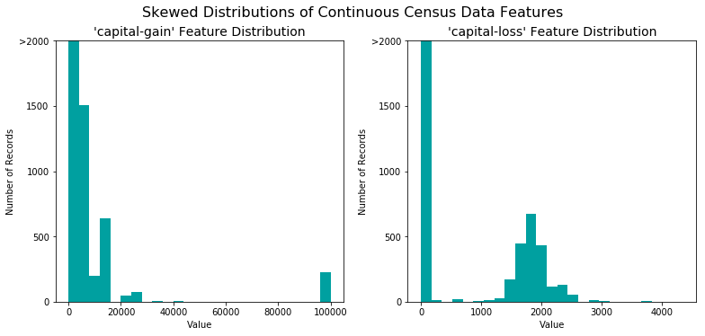
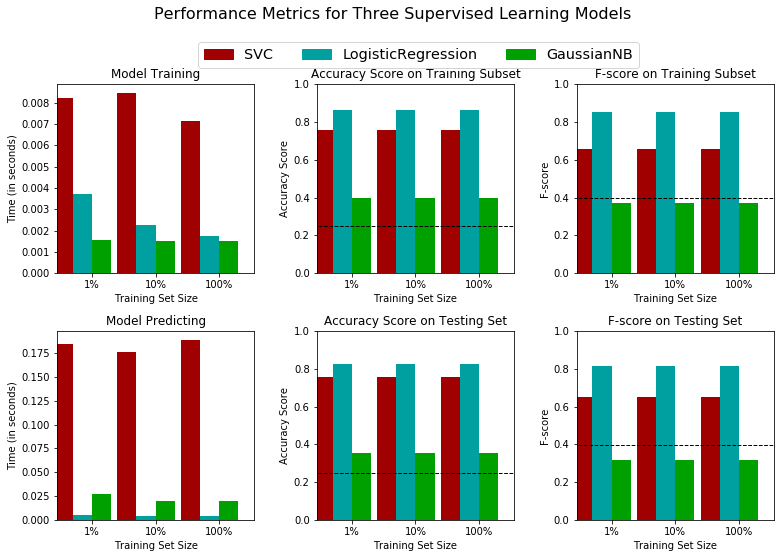

# Machine Learning Engineer Nanodegree
## Supervised Learning
## Project: Finding Donors for *CharityML*

Welcome to the second project of the Machine Learning Engineer Nanodegree! In this notebook, some template code has already been provided for you, and it will be your job to implement the additional functionality necessary to successfully complete this project. Sections that begin with **'Implementation'** in the header indicate that the following block of code will require additional functionality which you must provide. Instructions will be provided for each section and the specifics of the implementation are marked in the code block with a `'TODO'` statement. Please be sure to read the instructions carefully!

In addition to implementing code, there will be questions that you must answer which relate to the project and your implementation. Each section where you will answer a question is preceded by a **'Question X'** header. Carefully read each question and provide thorough answers in the following text boxes that begin with **'Answer:'**. Your project submission will be evaluated based on your answers to each of the questions and the implementation you provide.  

>**Note:** Please specify WHICH VERSION OF PYTHON you are using when submitting this notebook. Code and Markdown cells can be executed using the **Shift + Enter** keyboard shortcut. In addition, Markdown cells can be edited by typically double-clicking the cell to enter edit mode.

**Note:** I am using `Python 3.6.3 :: Anaconda custom (64-bit)` for this workbook.

##Getting Started

In this project, you will employ several supervised algorithms of your choice to accurately model individuals' income using data collected from the 1994 U.S. Census. You will then choose the best candidate algorithm from preliminary results and further optimize this algorithm to best model the data. Your goal with this implementation is to construct a model that accurately predicts whether an individual makes more than $50,000. This sort of task can arise in a non-profit setting, where organizations survive on donations.  Understanding an individual's income can help a non-profit better understand how large of a donation to request, or whether or not they should reach out to begin with.  While it can be difficult to determine an individual's general income bracket directly from public sources, we can (as we will see) infer this value from other publically available features. 

The dataset for this project originates from the [UCI Machine Learning Repository](https://archive.ics.uci.edu/ml/datasets/Census+Income). The datset was donated by Ron Kohavi and Barry Becker, after being published in the article _"Scaling Up the Accuracy of Naive-Bayes Classifiers: A Decision-Tree Hybrid"_. You can find the article by Ron Kohavi [online](https://www.aaai.org/Papers/KDD/1996/KDD96-033.pdf). The data we investigate here consists of small changes to the original dataset, such as removing the `'fnlwgt'` feature and records with missing or ill-formatted entries.

----
## Exploring the Data
Run the code cell below to load necessary Python libraries and load the census data. Note that the last column from this dataset, `'income'`, will be our target label (whether an individual makes more than, or at most, $50,000 annually). All other columns are features about each individual in the census database.


```python
# Import libraries necessary for this project
import numpy as np
import pandas as pd
from time import time
from IPython.display import display # Allows the use of display() for DataFrames

# Import supplementary visualization code visuals.py
import visuals as vs

# Pretty display for notebooks
%matplotlib inline

# Load the Census dataset
data = pd.read_csv("census.csv")

# Success - Display the first record
display(data.head(n=1))
```

<table border="1" class="dataframe">
  <thead>
    <tr style="text-align: right;">
      <th></th>
      <th>age</th>
      <th>workclass</th>
      <th>education_level</th>
      <th>education-num</th>
      <th>marital-status</th>
      <th>occupation</th>
      <th>relationship</th>
      <th>race</th>
      <th>sex</th>
      <th>capital-gain</th>
      <th>capital-loss</th>
      <th>hours-per-week</th>
      <th>native-country</th>
      <th>income</th>
    </tr>
  </thead>
  <tbody>
    <tr>
      <th>0</th>
      <td>39</td>
      <td>State-gov</td>
      <td>Bachelors</td>
      <td>13.0</td>
      <td>Never-married</td>
      <td>Adm-clerical</td>
      <td>Not-in-family</td>
      <td>White</td>
      <td>Male</td>
      <td>2174.0</td>
      <td>0.0</td>
      <td>40.0</td>
      <td>United-States</td>
      <td>&lt;=50K</td>
    </tr>
  </tbody>
</table>
</div>


###Implementation: Data Exploration
A cursory investigation of the dataset will determine how many individuals fit into either group, and will tell us about the percentage of these individuals making more than \$50,000. In the code cell below, you will need to compute the following:
- The total number of records, `'n_records'`
- The number of individuals making more than \$50,000 annually, `'n_greater_50k'`.
- The number of individuals making at most \$50,000 annually, `'n_at_most_50k'`.
- The percentage of individuals making more than \$50,000 annually, `'greater_percent'`.

** HINT: ** You may need to look at the table above to understand how the `'income'` entries are formatted. 


```python
# TODO: Total number of records
n_records = data.shape[0]
                
# TODO: Number of records where individual's income is more than $50,000
n_greater_50k = len(data[data['income'] == '>50K'])

# TODO: Number of records where individual's income is at most $50,000
n_at_most_50k = len(data[data['income'] == '<=50K'])

# TODO: Percentage of individuals whose income is more than $50,000
greater_percent = (n_greater_50k / n_records) * 100

# Print the results
print("Total number of records: {}".format(n_records))
print("Individuals making more than $50,000: {}".format(n_greater_50k))
print("Individuals making at most $50,000: {}".format(n_at_most_50k))
print("Percentage of individuals making more than $50,000: {}%".format(greater_percent))
```

    Total number of records: 45222
    Individuals making more than $50,000: 11208
    Individuals making at most $50,000: 34014
    Percentage of individuals making more than $50,000: 24.78439697492371%


** Featureset Exploration **

* **age**: continuous. 
* **workclass**: Private, Self-emp-not-inc, Self-emp-inc, Federal-gov, Local-gov, State-gov, Without-pay, Never-worked. 
* **education**: Bachelors, Some-college, 11th, HS-grad, Prof-school, Assoc-acdm, Assoc-voc, 9th, 7th-8th, 12th, Masters, 1st-4th, 10th, Doctorate, 5th-6th, Preschool. 
* **education-num**: continuous. 
* **marital-status**: Married-civ-spouse, Divorced, Never-married, Separated, Widowed, Married-spouse-absent, Married-AF-spouse. 
* **occupation**: Tech-support, Craft-repair, Other-service, Sales, Exec-managerial, Prof-specialty, Handlers-cleaners, Machine-op-inspct, Adm-clerical, Farming-fishing, Transport-moving, Priv-house-serv, Protective-serv, Armed-Forces. 
* **relationship**: Wife, Own-child, Husband, Not-in-family, Other-relative, Unmarried. 
* **race**: Black, White, Asian-Pac-Islander, Amer-Indian-Eskimo, Other. 
* **sex**: Female, Male. 
* **capital-gain**: continuous. 
* **capital-loss**: continuous. 
* **hours-per-week**: continuous. 
* **native-country**: United-States, Cambodia, England, Puerto-Rico, Canada, Germany, Outlying-US(Guam-USVI-etc), India, Japan, Greece, South, China, Cuba, Iran, Honduras, Philippines, Italy, Poland, Jamaica, Vietnam, Mexico, Portugal, Ireland, France, Dominican-Republic, Laos, Ecuador, Taiwan, Haiti, Columbia, Hungary, Guatemala, Nicaragua, Scotland, Thailand, Yugoslavia, El-Salvador, Trinadad&Tobago, Peru, Hong, Holand-Netherlands.

----
## Preparing the Data
Before data can be used as input for machine learning algorithms, it often must be cleaned, formatted, and restructured — this is typically known as **preprocessing**. Fortunately, for this dataset, there are no invalid or missing entries we must deal with, however, there are some qualities about certain features that must be adjusted. This preprocessing can help tremendously with the outcome and predictive power of nearly all learning algorithms.

### Transforming Skewed Continuous Features
A dataset may sometimes contain at least one feature whose values tend to lie near a single number, but will also have a non-trivial number of vastly larger or smaller values than that single number.  Algorithms can be sensitive to such distributions of values and can underperform if the range is not properly normalized. With the census dataset two features fit this description: '`capital-gain'` and `'capital-loss'`. 

Run the code cell below to plot a histogram of these two features. Note the range of the values present and how they are distributed.


```python
# Split the data into features and target label
income_raw = data['income']
features_raw = data.drop('income', axis = 1)

# Visualize skewed continuous features of original data
vs.distribution(data)
```





For highly-skewed feature distributions such as `'capital-gain'` and `'capital-loss'`, it is common practice to apply a <a href="https://en.wikipedia.org/wiki/Data_transformation_(statistics)">logarithmic transformation</a> on the data so that the very large and very small values do not negatively affect the performance of a learning algorithm. Using a logarithmic transformation significantly reduces the range of values caused by outliers. Care must be taken when applying this transformation however: The logarithm of `0` is undefined, so we must translate the values by a small amount above `0` to apply the the logarithm successfully.

Run the code cell below to perform a transformation on the data and visualize the results. Again, note the range of values and how they are distributed. 


```python
# Log-transform the skewed features
skewed = ['capital-gain', 'capital-loss']
features_log_transformed = pd.DataFrame(data = features_raw)
features_log_transformed[skewed] = features_raw[skewed].apply(lambda x: np.log(x + 1))

# Visualize the new log distributions
vs.distribution(features_log_transformed, transformed = True)
```


### Normalizing Numerical Features
In addition to performing transformations on features that are highly skewed, it is often good practice to perform some type of scaling on numerical features. Applying a scaling to the data does not change the shape of each feature's distribution (such as `'capital-gain'` or `'capital-loss'` above); however, normalization ensures that each feature is treated equally when applying supervised learners. Note that once scaling is applied, observing the data in its raw form will no longer have the same original meaning, as exampled below.

Run the code cell below to normalize each numerical feature. We will use [`sklearn.preprocessing.MinMaxScaler`](http://scikit-learn.org/stable/modules/generated/sklearn.preprocessing.MinMaxScaler.html) for this.


```python
# Import sklearn.preprocessing.StandardScaler
from sklearn.preprocessing import MinMaxScaler

# Initialize a scaler, then apply it to the features
scaler = MinMaxScaler() # default=(0, 1)
numerical = ['age', 'education-num', 'capital-gain', 'capital-loss', 'hours-per-week']

features_log_minmax_transform = pd.DataFrame(data = features_log_transformed)
features_log_minmax_transform[numerical] = scaler.fit_transform(features_log_transformed[numerical])

# Show an example of a record with scaling applied
display(features_log_minmax_transform.head(n = 5))
```

<table border="1" class="dataframe">
  <thead>
    <tr style="text-align: right;">
      <th></th>
      <th>age</th>
      <th>workclass</th>
      <th>education_level</th>
      <th>education-num</th>
      <th>marital-status</th>
      <th>occupation</th>
      <th>relationship</th>
      <th>race</th>
      <th>sex</th>
      <th>capital-gain</th>
      <th>capital-loss</th>
      <th>hours-per-week</th>
      <th>native-country</th>
    </tr>
  </thead>
  <tbody>
    <tr>
      <th>0</th>
      <td>0.301370</td>
      <td>State-gov</td>
      <td>Bachelors</td>
      <td>0.800000</td>
      <td>Never-married</td>
      <td>Adm-clerical</td>
      <td>Not-in-family</td>
      <td>White</td>
      <td>Male</td>
      <td>0.667492</td>
      <td>0.0</td>
      <td>0.397959</td>
      <td>United-States</td>
    </tr>
    <tr>
      <th>1</th>
      <td>0.452055</td>
      <td>Self-emp-not-inc</td>
      <td>Bachelors</td>
      <td>0.800000</td>
      <td>Married-civ-spouse</td>
      <td>Exec-managerial</td>
      <td>Husband</td>
      <td>White</td>
      <td>Male</td>
      <td>0.000000</td>
      <td>0.0</td>
      <td>0.122449</td>
      <td>United-States</td>
    </tr>
    <tr>
      <th>2</th>
      <td>0.287671</td>
      <td>Private</td>
      <td>HS-grad</td>
      <td>0.533333</td>
      <td>Divorced</td>
      <td>Handlers-cleaners</td>
      <td>Not-in-family</td>
      <td>White</td>
      <td>Male</td>
      <td>0.000000</td>
      <td>0.0</td>
      <td>0.397959</td>
      <td>United-States</td>
    </tr>
    <tr>
      <th>3</th>
      <td>0.493151</td>
      <td>Private</td>
      <td>11th</td>
      <td>0.400000</td>
      <td>Married-civ-spouse</td>
      <td>Handlers-cleaners</td>
      <td>Husband</td>
      <td>Black</td>
      <td>Male</td>
      <td>0.000000</td>
      <td>0.0</td>
      <td>0.397959</td>
      <td>United-States</td>
    </tr>
    <tr>
      <th>4</th>
      <td>0.150685</td>
      <td>Private</td>
      <td>Bachelors</td>
      <td>0.800000</td>
      <td>Married-civ-spouse</td>
      <td>Prof-specialty</td>
      <td>Wife</td>
      <td>Black</td>
      <td>Female</td>
      <td>0.000000</td>
      <td>0.0</td>
      <td>0.397959</td>
      <td>Cuba</td>
    </tr>
  </tbody>
</table>
</div>


### Implementation: Data Preprocessing

From the table in **Exploring the Data** above, we can see there are several features for each record that are non-numeric. Typically, learning algorithms expect input to be numeric, which requires that non-numeric features (called *categorical variables*) be converted. One popular way to convert categorical variables is by using the **one-hot encoding** scheme. One-hot encoding creates a _"dummy"_ variable for each possible category of each non-numeric feature. For example, assume `someFeature` has three possible entries: `A`, `B`, or `C`. We then encode this feature into `someFeature_A`, `someFeature_B` and `someFeature_C`.

|   | someFeature |                    | someFeature_A | someFeature_B | someFeature_C |
| :-: | :-: |                            | :-: | :-: | :-: |
| 0 |  B  |  | 0 | 1 | 0 |
| 1 |  C  | ----> one-hot encode ----> | 0 | 0 | 1 |
| 2 |  A  |  | 1 | 0 | 0 |

Additionally, as with the non-numeric features, we need to convert the non-numeric target label, `'income'` to numerical values for the learning algorithm to work. Since there are only two possible categories for this label ("<=50K" and ">50K"), we can avoid using one-hot encoding and simply encode these two categories as `0` and `1`, respectively. In code cell below, you will need to implement the following:
 - Use [`pandas.get_dummies()`](http://pandas.pydata.org/pandas-docs/stable/generated/pandas.get_dummies.html?highlight=get_dummies#pandas.get_dummies) to perform one-hot encoding on the `'features_log_minmax_transform'` data.
 - Convert the target label `'income_raw'` to numerical entries.
   - Set records with "<=50K" to `0` and records with ">50K" to `1`.


```python
# TODO: One-hot encode the 'features_log_minmax_transform' data using pandas.get_dummies()
features_final = pd.get_dummies(features_log_minmax_transform)

# TODO: Encode the 'income_raw' data to numerical values
income = income_raw.apply(lambda x: 0 if x == '<=50K' else 1)

# Print the number of features after one-hot encoding
encoded = list(features_final.columns)
print("{} total features after one-hot encoding.".format(len(encoded)))

# Uncomment the following line to see the encoded feature names
# print encoded
```

    103 total features after one-hot encoding.


### Shuffle and Split Data
Now all _categorical variables_ have been converted into numerical features, and all numerical features have been normalized. As always, we will now split the data (both features and their labels) into training and test sets. 80% of the data will be used for training and 20% for testing.

Run the code cell below to perform this split.


```python
# Import train_test_split
from sklearn.model_selection import train_test_split

# Split the 'features' and 'income' data into training and testing sets
X_train, X_test, y_train, y_test = train_test_split(features_final, 
                                                    income, 
                                                    test_size = 0.2, 
                                                    random_state = 0)

# Show the results of the split
print("Training set has {} samples.".format(X_train.shape[0]))
print("Testing set has {} samples.".format(X_test.shape[0]))
```

    Training set has 36177 samples.
    Testing set has 9045 samples.


----
## Evaluating Model Performance
In this section, we will investigate four different algorithms, and determine which is best at modeling the data. Three of these algorithms will be supervised learners of your choice, and the fourth algorithm is known as a *naive predictor*.

### Metrics and the Naive Predictor
*CharityML*, equipped with their research, knows individuals that make more than \$50,000 are most likely to donate to their charity. Because of this, *CharityML* is particularly interested in predicting who makes more than \$50,000 accurately. It would seem that using **accuracy** as a metric for evaluating a particular model's performace would be appropriate. Additionally, identifying someone that *does not* make more than \$50,000 as someone who does would be detrimental to *CharityML*, since they are looking to find individuals willing to donate. Therefore, a model's ability to precisely predict those that make more than \$50,000 is *more important* than the model's ability to **recall** those individuals. We can use **F-beta score** as a metric that considers both precision and recall:

$$ F_{\beta} = (1 + \beta^2) \cdot \frac{precision \cdot recall}{\left( \beta^2 \cdot precision \right) + recall} $$

In particular, when $\beta = 0.5$, more emphasis is placed on precision. This is called the **F$_{0.5}$ score** (or F-score for simplicity).

Looking at the distribution of classes (those who make at most \$50,000, and those who make more), it's clear most individuals do not make more than \$50,000. This can greatly affect **accuracy**, since we could simply say *"this person does not make more than \$50,000"* and generally be right, without ever looking at the data! Making such a statement would be called **naive**, since we have not considered any information to substantiate the claim. It is always important to consider the *naive prediction* for your data, to help establish a benchmark for whether a model is performing well. That been said, using that prediction would be pointless: If we predicted all people made less than \$50,000, *CharityML* would identify no one as donors. 


#### Note: Recap of accuracy, precision, recall

** Accuracy ** measures how often the classifier makes the correct prediction. It’s the ratio of the number of correct predictions to the total number of predictions (the number of test data points).

** Precision ** tells us what proportion of messages we classified as spam, actually were spam.
It is a ratio of true positives(words classified as spam, and which are actually spam) to all positives(all words classified as spam, irrespective of whether that was the correct classificatio), in other words it is the ratio of

`[True Positives/(True Positives + False Positives)]`

** Recall(sensitivity)** tells us what proportion of messages that actually were spam were classified by us as spam.
It is a ratio of true positives(words classified as spam, and which are actually spam) to all the words that were actually spam, in other words it is the ratio of

`[True Positives/(True Positives + False Negatives)]`

For classification problems that are skewed in their classification distributions like in our case, for example if we had a 100 text messages and only 2 were spam and the rest 98 weren't, accuracy by itself is not a very good metric. We could classify 90 messages as not spam(including the 2 that were spam but we classify them as not spam, hence they would be false negatives) and 10 as spam(all 10 false positives) and still get a reasonably good accuracy score. For such cases, precision and recall come in very handy. These two metrics can be combined to get the F1 score, which is weighted average(harmonic mean) of the precision and recall scores. This score can range from 0 to 1, with 1 being the best possible F1 score(we take the harmonic mean as we are dealing with ratios).

### Question 1 - Naive Predictor Performace
* If we chose a model that always predicted an individual made more than $50,000, what would  that model's accuracy and F-score be on this dataset? You must use the code cell below and assign your results to `'accuracy'` and `'fscore'` to be used later.

** Please note ** that the the purpose of generating a naive predictor is simply to show what a base model without any intelligence would look like. In the real world, ideally your base model would be either the results of a previous model or could be based on a research paper upon which you are looking to improve. When there is no benchmark model set, getting a result better than random choice is a place you could start from.

** HINT: ** 

* When we have a model that always predicts '1' (i.e. the individual makes more than 50k) then our model will have no True Negatives(TN) or False Negatives(FN) as we are not making any negative('0' value) predictions. Therefore our Accuracy in this case becomes the same as our Precision(True Positives/(True Positives + False Positives)) as every prediction that we have made with value '1' that should have '0' becomes a False Positive; therefore our denominator in this case is the total number of records we have in total. 
* Our Recall score(True Positives/(True Positives + False Negatives)) in this setting becomes 1 as we have no False Negatives.


```python
'''
TP = np.sum(income) # Counting the ones as this is the naive case. Note that 'income' is the 'income_raw' data 
encoded to numerical values done in the data preprocessing step.
FP = income.count() - TP # Specific to the naive case

TN = 0 # No predicted negatives in the naive case
FN = 0 # No predicted negatives in the naive case
'''
# TODO: Calculate accuracy, precision and recall
accuracy = n_greater_50k / n_records
recall = 1
precision = accuracy

# TODO: Calculate F-score using the formula above for beta = 0.5 and correct values for precision and recall.
fscore = 2 * ((precision * recall) / (precision + recall))

# Print the results 
print("Naive Predictor: [Accuracy score: {:.4f}, F-score: {:.4f}]".format(accuracy, fscore))
```

    Naive Predictor: [Accuracy score: 0.2478, F-score: 0.3972]


###  Supervised Learning Models
**The following are some of the supervised learning models that are currently available in** [`scikit-learn`](http://scikit-learn.org/stable/supervised_learning.html) **that you may choose from:**
- Gaussian Naive Bayes (GaussianNB)
- Decision Trees
- Ensemble Methods (Bagging, AdaBoost, Random Forest, Gradient Boosting)
- K-Nearest Neighbors (KNeighbors)
- Stochastic Gradient Descent Classifier (SGDC)
- Support Vector Machines (SVM)
- Logistic Regression

### Question 2 - Model Application
List three of the supervised learning models above that are appropriate for this problem that you will test on the census data. For each model chosen

- Describe one real-world application in industry where the model can be applied. 
- What are the strengths of the model; when does it perform well?
- What are the weaknesses of the model; when does it perform poorly?
- What makes this model a good candidate for the problem, given what you know about the data?

** HINT: **

Structure your answer in the same format as above^, with 4 parts for each of the three models you pick. Please include references with your answer.

**Answer: Question 2**

This problem requires the use of a binary classifier to predict if a given salary will be `<=50K` or `>50K`.  For this problem, I will propose to use the following machine learning models.

* **Logistic Regression**
* **Support Vector Machines**
* **Gaussian Naive Bayes**

*Logistic Regression*

**Describe one real-world application in industry where the model can be applied.** Predicting a binary outcome, to understand customer churn.  In this [paper,](https://analytics.ncsu.edu/sesug/2017/SESUG2017_Paper-191_Final_PDF.pdf) Sean Ankerbruck, outlines a method that uses logistic regression to, "[]identify important factors that influence churn and classify individuals based on their predicted likelihood
to churn."  

**What are the strengths of the model; when does it perform well?** Strengths of using logistic regression include the ability to output [probabilistic results](http://scikit-learn.org/stable/modules/generated/sklearn.linear_model.LogisticRegression.html#sklearn.linear_model.LogisticRegression.predict_proba) of the model. This can be of value since in some cases, we are not solely interested in knowing if a specific data point is in one class or another (i.e., class zero or one), but rather, knowing what is the probability that it belongs to one class or another (i.e, there is a 75% chance that this datapoint belongs to class one).  Another strength is that we are able to look at the weights (coefficients) of the terms (features) to identify the features that are most relevant to the overall prediction. For example, it is possible to know that out of all of the features, the most important feature is the `captial-gains` when determining if a user will make `>$50K`.  Another use of the coefficients is to know the following:

>If I increase the captial-gains value by one unit, then what is the change in probability that class 1 is assigned?   

**What are the weaknesses of the model; when does it perform poorly?** One *weakness* of this model is that it only be used to make binary classifications.  If you have a multi-class problem, then you're going to need to consider another model.  In addition, if your features are non-linear, then logistic regression may not work since it is a [linear model](https://stats.stackexchange.com/questions/93569/why-is-logistic-regression-a-linear-classifier) and requires the dataset to be linearly separable.

**What makes this model a good candidate for the problem, given what you know about the data?** Logistic regression is a good candidate for this problem since we have a binary outcome, and an array of input features. As mentioned earlier, when using this model, we are not only able to know which class is being assigned to the datapoint, but also know the probability, or the strength that certain datapoint belongs to one class or another.  In other words, we will be able to find cases, where a user belongs to `>$50K` but by only small amount (e.g., 61%). 


*Support Vector Machines*

**Describe one real-world application in industry where the model can be applied.** One example of using a support vector machine in the real-world includes the development of a  bankruptcy prediction model. In this [paper](http://citeseerx.ist.psu.edu/viewdoc/download;jsessionid=B21D947ACCF7DFA22075A071209C8836?doi=10.1.1.98.2804&rep=rep1&type=pdf), Shin, et. al., outlines the development of such a model using a "small" training dataset of 2,300 observations. 

**What are the strengths of the model; when does it perform well?** One strength of using support vector machine is that you are able to use the model on [small datasets](https://stats.stackexchange.com/questions/47209/what-are-good-techniques-for-modeling-small-datasets). Depending on the business case, you may not have access or have the ability to work with a *large* dataset, and this can have adverse impacts on the final results of the analysis. Knowing that a SVM works well with small datasets is of value in the case that you are trying to solve a classification problem but don't have access to a large dataset. In addition, if you have non-linear data, or data that is not linearly separable, then using an SVM with a [non-linear kernel like rbf may be of help](https://stats.stackexchange.com/questions/95340/comparing-svm-and-logistic-regression).

**What are the weaknesses of the model; when does it perform poorly?** One problem that I have read about when using a SVM is that training the model can be computationally intensive as the dataset get large (i.e., *O(n<sup>3</sup>)* for [Kernel Methods](https://stats.stackexchange.com/questions/327646/how-does-a-random-kitchen-sink-work)).  In the case of large datasets, sometimes, performing a [dimensionality reduction](http://people.eecs.berkeley.edu/~brecht/papers/07.rah.rec.nips.pdf) is needed to get the model to work efficiency.  In terms of performance, an [**SVM doesn't perform well** if you have highly skewed data](https://www.quora.com/For-what-kind-of-classification-problems-is-SVM-a-bad-approach) (like finding credit card fraud).

**What makes this model a good candidate for the problem, given what you know about the data?** 

An SVM can perform well in this case since we are making a [binary classification.
](https://www.quora.com/For-what-kind-of-classification-problems-is-SVM-a-bad-approach)

*Gaussian Naive Bayes*

**Describe one real-world application in industry where the model can be applied.** 

One real world example of Gaussian Naive Bayes in the prediction of bankruptcies (see [here](http://citeseerx.ist.psu.edu/viewdoc/download?doi=10.1.1.84.7345&rep=rep1&type=pdf)).  A Gaussian Naive Bayes would work in this case since the features (gross revenue, expenditures, etc.) are continuous, as opposed to discrete.  

**What are the strengths of the model; when does it perform well?** 

A few strengths of the Gaussian Naive Bayes model is that is can make probabilistic predictions similar to logistic regression. In general, the model performs well even if you have a small dataset (see [here](https://www.quora.com/What-are-the-advantages-of-using-a-naive-Bayes-for-classification))

**What are the weaknesses of the model; when does it perform poorly?** 

One weakness of the model is that there is an assumption about the type of distribution that is being used in the model (either Gaussian or Multinomial). Therefore, if you have a dataset that maybe using another type of distribution, your model may not work properly.

**What makes this model a good candidate for the problem, given what you know about the data?**

In this case, the Gaussian Naive Bayes is a good candidate since the overlying assumption that all of the output features are independent of each other. When estimating salary, it is ideal to think that your earning potential should be based on [independent features as opposed to dependent ones.](https://www.quora.com/What-is-the-difference-between-logistic-regression-and-Naive-Bayes) For example, the salary of a 50 yr old female as opposed to a 50 yr old male should be based, on two features age, and gender, not both.  In society, it is quite common to have salaries be based on features that are dependent on each other as opposed to being independent. In addition, Gaussian Naive Bayes is a good candidate since we are working with a binary classification (just like the text book example of this model -- Spam classification). 


### Implementation - Creating a Training and Predicting Pipeline
To properly evaluate the performance of each model you've chosen, it's important that you create a training and predicting pipeline that allows you to quickly and effectively train models using various sizes of training data and perform predictions on the testing data. Your implementation here will be used in the following section.
In the code block below, you will need to implement the following:
 - Import `fbeta_score` and `accuracy_score` from [`sklearn.metrics`](http://scikit-learn.org/stable/modules/classes.html#sklearn-metrics-metrics).
 - Fit the learner to the sampled training data and record the training time.
 - Perform predictions on the test data `X_test`, and also on the first 300 training points `X_train[:300]`.
   - Record the total prediction time.
 - Calculate the accuracy score for both the training subset and testing set.
 - Calculate the F-score for both the training subset and testing set.
   - Make sure that you set the `beta` parameter!


```python
# TODO: Import two metrics from sklearn - fbeta_score and accuracy_score
from sklearn.metrics import fbeta_score, accuracy_score, f1_score
from time import time

def train_predict(learner, sample_size, X_train, y_train, X_test, y_test): 
    '''
    inputs:
       - learner: the learning algorithm to be trained and predicted on
       - sample_size: the size of samples (number) to be drawn from training set
       - X_train: features training set
       - y_train: income training set
       - X_test: features testing set
       - y_test: income testing set
    '''
    
    results = {}
    
    # TODO: Fit the learner to the training data using slicing with 'sample_size' using .fit(training_features[:], training_labels[:])
    start = time() # Get start time
    learner.fit(X_train[:300], y_train[:300])
    end = time() # Get end time
    
    # TODO: Calculate the training time
    results['train_time'] = end - start
        
    # TODO: Get the predictions on the test set(X_test),
    #       then get predictions on the first 300 training samples(X_train) using .predict()
    start = time() # Get start time
    predictions_test = learner.predict(X_test)
    predictions_train = learner.predict(X_train[:300])
    end = time() # Get end time
    
    # TODO: Calculate the total prediction time
    results['pred_time'] = end - start
            
    # TODO: Compute accuracy on the first 300 training samples which is y_train[:300]
    results['acc_train'] = accuracy_score(y_train[:300], predictions_train)
        
    # TODO: Compute accuracy on test set using accuracy_score()
    results['acc_test'] = accuracy_score(y_test, predictions_test)
    
    # TODO: Compute F-score on the the first 300 training samples using fbeta_score()
    results['f_train'] = f1_score(y_train[:300], predictions_train, average='weighted')
        
    # TODO: Compute F-score on the test set which is y_test
    results['f_test'] = f1_score(y_test, predictions_test, average='weighted')
       
    # Success
    print("{} trained on {} samples.".format(learner.__class__.__name__, sample_size))
        
    # Return the results
    return results
```

### Implementation: Initial Model Evaluation
In the code cell, you will need to implement the following:
- Import the three supervised learning models you've discussed in the previous section.
- Initialize the three models and store them in `'clf_A'`, `'clf_B'`, and `'clf_C'`.
  - Use a `'random_state'` for each model you use, if provided.
  - **Note:** Use the default settings for each model — you will tune one specific model in a later section.
- Calculate the number of records equal to 1%, 10%, and 100% of the training data.
  - Store those values in `'samples_1'`, `'samples_10'`, and `'samples_100'` respectively.

**Note:** Depending on which algorithms you chose, the following implementation may take some time to run!


```python
# TODO: Import the three supervised learning models from sklearn
from sklearn.svm import SVC
from sklearn.linear_model import LogisticRegression
from sklearn.naive_bayes import GaussianNB
from sklearn.ensemble import GradientBoostingClassifier

# TODO: Initialize the three models
clf_A = SVC(random_state=42)
clf_B = LogisticRegression(random_state=100)
clf_C = GaussianNB()

# TODO: Calculate the number of samples for 1%, 10%, and 100% of the training data
# HINT: samples_100 is the entire training set i.e. len(y_train)
# HINT: samples_10 is 10% of samples_100 (ensure to set the count of the values to be `int` and not `float`)
# HINT: samples_1 is 1% of samples_100 (ensure to set the count of the values to be `int` and not `float`)
samples_100 = len(y_train)
samples_10 = int(float(len(y_train) * 0.1))
samples_1 = int(float(len(y_train) * 0.01))

# Collect results on the learners
results = {}
for clf in [clf_A, clf_B, clf_C]:
    clf_name = clf.__class__.__name__
    results[clf_name] = {}
    for i, samples in enumerate([samples_1, samples_10, samples_100]):
        results[clf_name][i] = train_predict(clf, samples, X_train, y_train, X_test, y_test)

# Run metrics visualization for the three supervised learning models chosen
vs.evaluate(results, accuracy, fscore)
```

    /Users/gta/anaconda3/lib/python3.6/site-packages/sklearn/metrics/classification.py:1135: UndefinedMetricWarning: F-score is ill-defined and being set to 0.0 in labels with no predicted samples.
      'precision', 'predicted', average, warn_for)


    SVC trained on 361 samples.
    SVC trained on 3617 samples.
    SVC trained on 36177 samples.
    LogisticRegression trained on 361 samples.
    LogisticRegression trained on 3617 samples.
    LogisticRegression trained on 36177 samples.
    GaussianNB trained on 361 samples.
    GaussianNB trained on 3617 samples.
    GaussianNB trained on 36177 samples.





----
## Improving Results
In this final section, you will choose from the three supervised learning models the *best* model to use on the student data. You will then perform a grid search optimization for the model over the entire training set (`X_train` and `y_train`) by tuning at least one parameter to improve upon the untuned model's F-score. 

### Question 3 - Choosing the Best Model

* Based on the evaluation you performed earlier, in one to two paragraphs, explain to *CharityML* which of the three models you believe to be most appropriate for the task of identifying individuals that make more than \$50,000. 

** HINT: ** 
Look at the graph at the bottom left from the cell above(the visualization created by `vs.evaluate(results, accuracy, fscore)`) and check the F score for the testing set when 100% of the training set is used. Which model has the highest score? Your answer should include discussion of the:
* metrics - F score on the testing when 100% of the training data is used, 
* prediction/training time
* the algorithm's suitability for the data.

**Answer:  Question 3**

Based on the three models selected, we recommend that the best model that is used for *CharityML* is **Logistic Regression**. This recommendation is based on the following.

**First**, as compared the SVC and the Gradient Boosted Classifier, the Logistic Regression model is the quickest to train on 100% of the dataset.   From the Model Training charts creating using the `vs.evaluate(results, accuracy, fscore)` function, there is an inverse relationship between the training times of the `SVC` and `LogisticRegression`.  That means that as the dataset gets larger, the time to train the dataset get shorter for logistic regression and larger for the SVC.

**Second,** there seems to be less overfitting with the logistic regression model as compared to the Gradient Boosting Classifier.  Specifically, the difference in the `F1` score, at 100% of the training data, is about 15 basis points for the Gradient Boosting Classifier, but about 5 points for the logistic regression model. In general, the degree to which a model overfits can be a cause of concern since overfitting is an indication of poor generalization (which is something that we strive to avoid when doing as a machine learning engineer). 

It is understood that the F1 score is higher for the Gradient Boosting Classifier, however, from the standpoint of overfitting, I have taken the position that is it is more important to have a model that does not overfit, even at the expense   of performance.  In an actual case, the decision to pick a model based on it's performance or over- or under-fitting is something that should be established before starting the project. 

### Question 4 - Describing the Model in Layman's Terms

* In one to two paragraphs, explain to *CharityML*, in layman's terms, how the final model chosen is supposed to work. Be sure that you are describing the major qualities of the model, such as how the model is trained and how the model makes a prediction. Avoid using advanced mathematical jargon, such as describing equations.

** HINT: **

When explaining your model, if using external resources please include all citations.

**Answer: Question 4**

The logistic regression model is a classifier that can predict of a certain datapoint belongs to one class or another (think, is this a cat or a dog).

How the model does this is quite complex, but it can be broken down into a few simple steps.

First, as in the cat/dog case, the model determines what are the most important features of what makes a cat a cat and what makes a dog a dog based on the data you provide. For example, an important feature can be the length of the muzzle. Dogs tend to have longer muzzles than cats. 

In general, the model is developing a quantitive relationship between each of the input values (or features or characteristics) and the output class. As an example, muzzle length, tail length, height to top of head, body length, etc.

During the training of the model, all of these characteristics are assigned weights that determine how important that input value is when determining the output class. These weights are continuous and can be positive or negative and a larger number for the weight means the more important the feature or input value is to the classification.

Second, once the model identifies the most important features (or assigns the weights to each feature), the model will look at a test point, or the point that you want to classify. 

Based on the features that the model thought was important, the model will look at the new data point and assign a probability (between 0-1) of what class to place the point into based on the features or input values for the new data point.

For example, if the new datapoint has a long muzzle, the model will likely assign a high probability (e.g, 0.8) to classify the image as being a dog. On the other hand, if the muzzle length is small, then the model may assign a smaller probability (e.g., 0.25) that the new point is a dog. When developing the model, the cut off point is typically 0.5 for classification. This means that the model will assign the class if the probability is above or below 0.5 (> 0.5 will be assigned to class 1 and < 0.5 will be assigned to class 0).

### Implementation: Model Tuning
Fine tune the chosen model. Use grid search (`GridSearchCV`) with at least one important parameter tuned with at least 3 different values. You will need to use the entire training set for this. In the code cell below, you will need to implement the following:
- Import [`sklearn.grid_search.GridSearchCV`](http://scikit-learn.org/0.17/modules/generated/sklearn.grid_search.GridSearchCV.html) and [`sklearn.metrics.make_scorer`](http://scikit-learn.org/stable/modules/generated/sklearn.metrics.make_scorer.html).
- Initialize the classifier you've chosen and store it in `clf`.
 - Set a `random_state` if one is available to the same state you set before.
- Create a dictionary of parameters you wish to tune for the chosen model.
 - Example: `parameters = {'parameter' : [list of values]}`.
 - **Note:** Avoid tuning the `max_features` parameter of your learner if that parameter is available!
- Use `make_scorer` to create an `fbeta_score` scoring object (with $\beta = 0.5$).
- Perform grid search on the classifier `clf` using the `'scorer'`, and store it in `grid_obj`.
- Fit the grid search object to the training data (`X_train`, `y_train`), and store it in `grid_fit`.

**Note:** Depending on the algorithm chosen and the parameter list, the following implementation may take some time to run!


```python
# TODO: Import 'GridSearchCV', 'make_scorer', and any other necessary libraries
from sklearn.model_selection import GridSearchCV
from sklearn.metrics import make_scorer
from sklearn.linear_model import LogisticRegression
from sklearn.metrics import fbeta_score

# TODO: Initialize the classifier
clf = LogisticRegression()

# TODO: Create the parameters list you wish to tune, using a dictionary if needed.
# HINT: parameters = {'parameter_1': [value1, value2], 'parameter_2': [value1, value2]}
parameters = {'C': [0.01, 0.001, 1], 
              'random_state': [10, 100, 42], 
              'penalty': ['l1', 'l2']}

# TODO: Make an fbeta_score scoring object using make_scorer()
scorer = make_scorer(fbeta_score, beta=0.5)

# TODO: Perform grid search on the classifier using 'scorer' as the scoring method using GridSearchCV()
grid_obj = GridSearchCV(clf, parameters, scoring=scorer)

# TODO: Fit the grid search object to the training data and find the optimal parameters using fit()
grid_fit = grid_obj.fit(X_train, y_train)

# Get the estimator
best_clf = grid_fit.best_estimator_

# Make predictions using the unoptimized and model
predictions = (clf.fit(X_train, y_train)).predict(X_test)
best_predictions = best_clf.predict(X_test)

# Report the before-and-afterscores
print("Unoptimized model\n------")
print("Accuracy score on testing data: {:.4f}".format(accuracy_score(y_test, predictions)))
print("F-score on testing data: {:.4f}".format(fbeta_score(y_test, predictions, beta = 0.5)))
print("\nOptimized Model\n------")
print("Final accuracy score on the testing data: {:.4f}".format(accuracy_score(y_test, best_predictions)))
print("Final F-score on the testing data: {:.4f}".format(fbeta_score(y_test, best_predictions, beta = 0.5)))
print("\nBest Model\n------")
print(best_clf)
```

    /Users/gta/anaconda3/lib/python3.6/site-packages/sklearn/metrics/classification.py:1135: UndefinedMetricWarning: F-score is ill-defined and being set to 0.0 due to no predicted samples.
      'precision', 'predicted', average, warn_for)
    /Users/gta/anaconda3/lib/python3.6/site-packages/sklearn/metrics/classification.py:1135: UndefinedMetricWarning: F-score is ill-defined and being set to 0.0 due to no predicted samples.
      'precision', 'predicted', average, warn_for)
    /Users/gta/anaconda3/lib/python3.6/site-packages/sklearn/metrics/classification.py:1135: UndefinedMetricWarning: F-score is ill-defined and being set to 0.0 due to no predicted samples.
      'precision', 'predicted', average, warn_for)
    /Users/gta/anaconda3/lib/python3.6/site-packages/sklearn/metrics/classification.py:1135: UndefinedMetricWarning: F-score is ill-defined and being set to 0.0 due to no predicted samples.
      'precision', 'predicted', average, warn_for)
    /Users/gta/anaconda3/lib/python3.6/site-packages/sklearn/metrics/classification.py:1135: UndefinedMetricWarning: F-score is ill-defined and being set to 0.0 due to no predicted samples.
      'precision', 'predicted', average, warn_for)
    /Users/gta/anaconda3/lib/python3.6/site-packages/sklearn/metrics/classification.py:1135: UndefinedMetricWarning: F-score is ill-defined and being set to 0.0 due to no predicted samples.
      'precision', 'predicted', average, warn_for)
    /Users/gta/anaconda3/lib/python3.6/site-packages/sklearn/metrics/classification.py:1135: UndefinedMetricWarning: F-score is ill-defined and being set to 0.0 due to no predicted samples.
      'precision', 'predicted', average, warn_for)
    /Users/gta/anaconda3/lib/python3.6/site-packages/sklearn/metrics/classification.py:1135: UndefinedMetricWarning: F-score is ill-defined and being set to 0.0 due to no predicted samples.
      'precision', 'predicted', average, warn_for)
    /Users/gta/anaconda3/lib/python3.6/site-packages/sklearn/metrics/classification.py:1135: UndefinedMetricWarning: F-score is ill-defined and being set to 0.0 due to no predicted samples.
      'precision', 'predicted', average, warn_for)


    Unoptimized model
    ------
    Accuracy score on testing data: 0.8419
    F-score on testing data: 0.6832
    
    Optimized Model
    ------
    Final accuracy score on the testing data: 0.8419
    Final F-score on the testing data: 0.6832
    
    Best Model
    ------
    LogisticRegression(C=1, class_weight=None, dual=False, fit_intercept=True,
              intercept_scaling=1, max_iter=100, multi_class='ovr', n_jobs=1,
              penalty='l2', random_state=100, solver='liblinear', tol=0.0001,
              verbose=0, warm_start=False)


### Question 5 - Final Model Evaluation

* What is your optimized model's accuracy and F-score on the testing data? 
* Are these scores better or worse than the unoptimized model? 
* How do the results from your optimized model compare to the naive predictor benchmarks you found earlier in **Question 1**?_  

**Note:** Fill in the table below with your results, and then provide discussion in the **Answer** box.

#### Results:

|     Metric     | Baseline Model       |Unoptimized Model | Optimized Model |
| :------------: |:-------------------: |:---------------: | :-------------: | 
| Accuracy Score |        0.2478        |         0.86304  |          0.8419 |
| F-score        |        0.3972        |          0.7395  |   0.6832        |


**Answer: Question 5 **

During the model optimization step, we found that our model does worse as compared to the unoptimized variant.  For example, during the training step, we saw `F1` scores for the logistic regression model in the area of 0.8, however, during the optimization step, we saw `F1` value in the area of 0.68. In both cases, we set `random_state=100` to ensure that we are on the same playing field. 

Despite the optimized model performing worse than the unoptimized variant, the optimized model still does perform better than the baseline model that that we assessed in Question 1.  For reference, the baseline model is one that always predicts that an individual made more than \$50,000.  As compared to the baseline, the optimized model has an F1 score that is more than 100% higher that for the baseline model.  In terms of the accuracy of the optimized model, the optimized model has an accuracy score that is more than 300% that of the baseline model. 

----
## Feature Importance

An important task when performing supervised learning on a dataset like the census data we study here is determining which features provide the most predictive power. By focusing on the relationship between only a few crucial features and the target label we simplify our understanding of the phenomenon, which is most always a useful thing to do. In the case of this project, that means we wish to identify a small number of features that most strongly predict whether an individual makes at most or more than \$50,000.

Choose a scikit-learn classifier (e.g., adaboost, random forests) that has a `feature_importance_` attribute, which is a function that ranks the importance of features according to the chosen classifier.  In the next python cell fit this classifier to training set and use this attribute to determine the top 5 most important features for the census dataset.

### Question 6 - Feature Relevance Observation
When **Exploring the Data**, it was shown there are thirteen available features for each individual on record in the census data. Of these thirteen records, which five features do you believe to be most important for prediction, and in what order would you rank them and why?

**Answer: Question 6**

Of the 13 features listed in the dataset, I believe that the five most important features that drive the prediction of making more than \$50,000 is, in descending order of importance:

* Education Level
* Native County
* Hours-per-week worked
* Occupation
* Workclass

**Native County:** Out of all of the features, the one that is the largest driver if someone can make more than \$50,000 per year is the country that they are located in. Since each county operates on a different economic system, the cost of living is different in each county.  I'd like to assume that companies pay according to to the value provided relative to the market of that country.  Therefore, in wealthier countries the criteria for earning more than \$50,000 may be quite different than ones that are not as wealthy.  To get around this, it may be helpful to normalize all of the earnings to one county or a uniform metric as to remove the the dependencies of cost of living and specific economic factors from the analysis.

**Education Level:** In general, I feel that someone who has more education will be paid higher since there should be a relationship between the education level and the occupation of the individual. In this case, folks that have the occupation of `Exec-managerial` or `Prof-specialty` should have more education and therefore earnings.

**Occupation:** Similar to the point noted on education, I believe that occupation is a strong predictor of earnings, or the ability to earn more than \$50,000 per year. Again, I feel that folks that have the occupation of `Exec-managerial` or `Prof-specialty` should have more education and therefore higher earnings 

**Hours-per-week worked:** From experience, it seems that people who work long hours do end up making more in both management and non-management roles.  For managers, this is due to more responsibility which requires you to do more. In the non-management role, I have typically seen this be the result of working more overtime which does equate to a higher annual salary at the end of the year. 

**Workclass:** In my experience, work class is a good indicator if someone can earn more than \$50,000 per year.  I saw this because in certain industries, like engineering, it is possible to earn more money working for a state or local government than working in the private sector.  From what I have seen, the reason for this is that these types of employers have labor unions that fight for higher wages for the employees.  This type of setup is less prevalent in the private sector which is why I say that it can be easier for a public sector employee to earn more than $50,000 per year.


### Implementation - Extracting Feature Importance
Choose a `scikit-learn` supervised learning algorithm that has a `feature_importance_` attribute availble for it. This attribute is a function that ranks the importance of each feature when making predictions based on the chosen algorithm.

In the code cell below, you will need to implement the following:
 - Import a supervised learning model from sklearn if it is different from the three used earlier.
 - Train the supervised model on the entire training set.
 - Extract the feature importances using `'.feature_importances_'`.


```python
# TODO: Import a supervised learning model that has 'feature_importances_'
from sklearn.ensemble import GradientBoostingClassifier

# TODO: Train the supervised model on the training set using .fit(X_train, y_train)
model = GradientBoostingClassifier()
model.fit(X_train, y_train)

# TODO: Extract the feature importances using .feature_importances_ 
importances = model.feature_importances_ 

# Plot
vs.feature_plot(importances, X_train, y_train)
```


### Question 7 - Extracting Feature Importance

Observe the visualization created above which displays the five most relevant features for predicting if an individual makes at most or above \$50,000.  
* How do these five features compare to the five features you discussed in **Question 6**?
* If you were close to the same answer, how does this visualization confirm your thoughts? 
* If you were not close, why do you think these features are more relevant?

**Answer:  Question 7**

In reviewing the chart created for Question 7, my predictions were very different than what the model came up with.  For example, the most important feature that the model predicted is `captial-gain` whereas I noted that `Native County`.  In fact, **none** of the features that I noted in my list appeared in the list of important features generated from the model. 

The single best explanation that I have for this, is that I selected discrete features , where as the ones that the model selected were continuous, except for the martial status. Although, I will add that it does make sense that a person will have a higher income if they have higher amounts of capital gains.

### Feature Selection
How does a model perform if we only use a subset of all the available features in the data? With less features required to train, the expectation is that training and prediction time is much lower — at the cost of performance metrics. From the visualization above, we see that the top five most important features contribute more than half of the importance of **all** features present in the data. This hints that we can attempt to *reduce the feature space* and simplify the information required for the model to learn. The code cell below will use the same optimized model you found earlier, and train it on the same training set *with only the top five important features*. 


```python
# Import functionality for cloning a model
from sklearn.base import clone

# Reduce the feature space
X_train_reduced = X_train[X_train.columns.values[(np.argsort(importances)[::-1])[:5]]]
X_test_reduced = X_test[X_test.columns.values[(np.argsort(importances)[::-1])[:5]]]

# Train on the "best" model found from grid search earlier
clf = (clone(best_clf)).fit(X_train_reduced, y_train)

# Make new predictions
reduced_predictions = clf.predict(X_test_reduced)

# Report scores from the final model using both versions of data
print("Final Model trained on full data\n------")
print("Accuracy on testing data: {:.4f}".format(accuracy_score(y_test, best_predictions)))
print("F-score on testing data: {:.4f}".format(fbeta_score(y_test, best_predictions, beta = 0.5)))
print("\nFinal Model trained on reduced data\n------")
print("Accuracy on testing data: {:.4f}".format(accuracy_score(y_test, reduced_predictions)))
print("F-score on testing data: {:.4f}".format(fbeta_score(y_test, reduced_predictions, beta = 0.5)))
```

    Final Model trained on full data
    ------
    Accuracy on testing data: 0.8419
    F-score on testing data: 0.6832
    
    Final Model trained on reduced data
    ------
    Accuracy on testing data: 0.8284
    F-score on testing data: 0.6520


### Question 8 - Effects of Feature Selection

* How does the final model's F-score and accuracy score on the reduced data using only five features compare to those same scores when all features are used?
* If training time was a factor, would you consider using the reduced data as your training set?

**Answer: Question 8**

This seems to be a good example of dimensionality reduction done correct. In this case, we have reduced our feature space from 13 down to five, and in doing so, we are able to have `F1` scores that are close to that of the full feature space. What these results suggests is that the variability of the full dataset are preserved quite well in a dataset that only has five features (sigue to  to [Principal Component Analysis](http://setosa.io/ev/principal-component-analysis/) in the unsupervised learning section).  In the case that there was a strong dependency between training time and feature space, I would consider using the smaller feature space in the model since it can help reduce the amount of time to get the overall model to production. 

> **Note**: Once you have completed all of the code implementations and successfully answered each question above, you may finalize your work by exporting the iPython Notebook as an HTML document. You can do this by using the menu above and navigating to  
**File -> Download as -> HTML (.html)**. Include the finished document along with this notebook as your submission.
